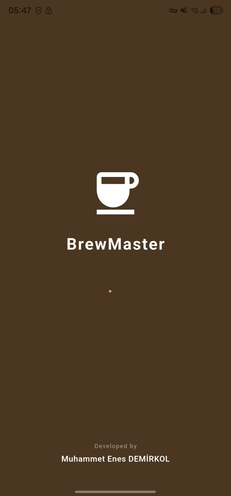
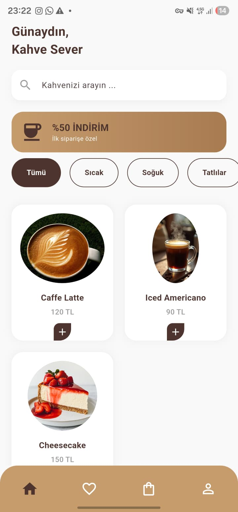
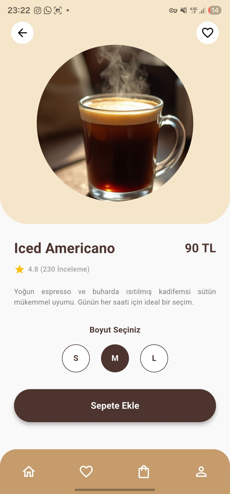

# ☕ BrewMaster - Coffee Shop Catalog App


**BrewMaster**, modern ve kullanıcı dostu bir arayüze sahip, kahve ürünlerini listeleyen ve detaylarını sunan bir mobil katalog uygulamasıdır. Bu proje, **Mobil Uygulama Geliştirme Eğitimi** kapsamında geliştirilmiştir.

## 📱 Proje Özellikleri (Features)

Bu uygulama, temel Flutter yetkinliklerini ve UI/UX prensiplerini sergilemektedir:

* **🎨 Özel Açılış Ekranı (Splash Screen):** Marka logosu ve geliştirici imzasını içeren profesyonel giriş.
* **🔍 Gerçek Zamanlı Arama (Real-time Search):** Kullanıcıların kahve ismine göre anlık filtreleme yapabilmesi.
* **✨ Hero Animasyonları:** Liste ve detay sayfası arasında akıcı görsel geçişler.
* **📂 JSON Veri Yönetimi:** Yerel JSON dosyasından asenkron veri okuma ve modelleme.
* **❤️ Favori Simülasyonu:** `setState` kullanılarak anlık durum (state) yönetimi.
* **📱 Responsive Tasarım:** `GridView` kullanılarak farklı ekran boyutlarına uyumlu arayüz.

## 📸 Ekran Görüntüleri (Screenshots)

| Açılış Ekranı | Ana Sayfa | Ürün Detayı | Sepet |
|:---:|:---:|:---:|:---:|
|  |  |  |  |

*(Not: Ekran görüntüleri temsilidir, proje çalıştırıldığında canlı olarak görüntülenebilir.)*

## 🛠️ Kullanılan Teknolojiler ve Mimari

Proje, temiz kod (Clean Code) prensiplerine sadık kalınarak geliştirilmiştir.

* **Framework:** Flutter (3.x)
* **Dil:** Dart
* **Veri Kaynağı:** Local Assets (`products.json`)
* **Mimari Yaklaşım:** MVC (Model-View Separation)

### Klasör Yapısı (Folder Structure)

```text
lib/
├── models/          # Veri modelleri (Product Model)
├── screens/         # Uygulama sayfaları (Home, Detail, Splash)
├── widgets/         # Tekrar kullanılabilir arayüz parçaları
├── main.dart        # Uygulama giriş noktası ve Tema ayarları
assets/
├── data/            # JSON veri dosyası (products.json)
└── images/          # Görsel materyaller
```

## 🚀 Kurulum ve Çalıştırma (Installation)
Projeyi kendi bilgisayarınızda çalıştırmak için aşağıdaki adımları izleyin:

1) Projeyi klonlayın:

```bash
git clone https://github.com/KULLANICI_ADINIZ/brewmaster_app.git
```

Proje dizinine gidin:

```bash
cd brewmaster_app
```

Gerekli paketleri yükleyin:

```bash
flutter pub get
```

Uygulamayı çalıştırın:

```bash
flutter run
```

## 👨‍💻 Geliştirici (Developer)
Muhammet Enes DEMİRKOL
